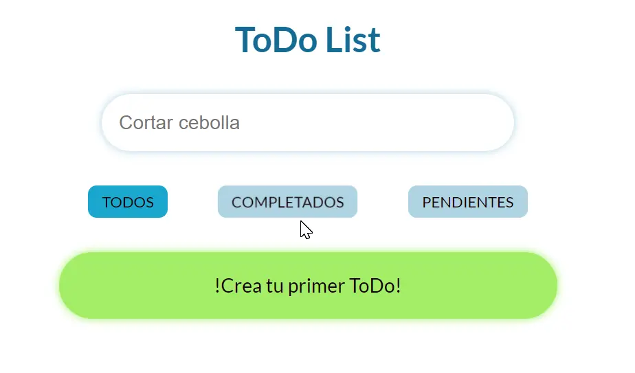
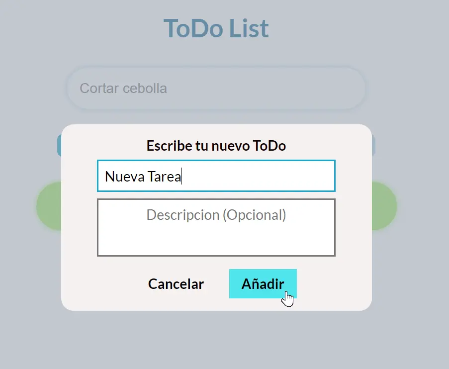
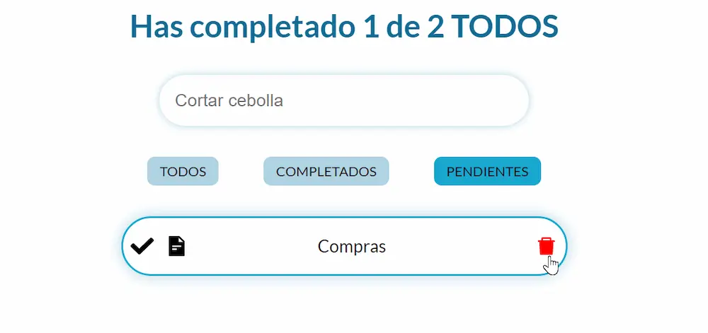

# ToDo List

## Descripcion
Este proyecto es un sitio web donde puedes hacer ToDo's, esta hecho con tecnologias como React y Sass, el sitio web tiene funcionalidades como:
- Crear y editar ToDo's.
- Poder marcar y desmarcar las tareas como completadas.
- Contador que marca el numero de tareas completadas.
- Filtrar ToDo's por su titulo o su estado (completado, pendiente).
- Local Storage (Los ToDo's creados y modificados se guardan cuando se cierra la pagina).

Para el proyecto se utilizo React para la organizacion de componentes con uso de useState, useEffect, useContext, entre otras funcionalidades de la libreria y Sass para el facil y reusable estilado de componentes.

## Despliegue 
https://soyrandy708.github.io/ToDo-List/

    
    
    
    

