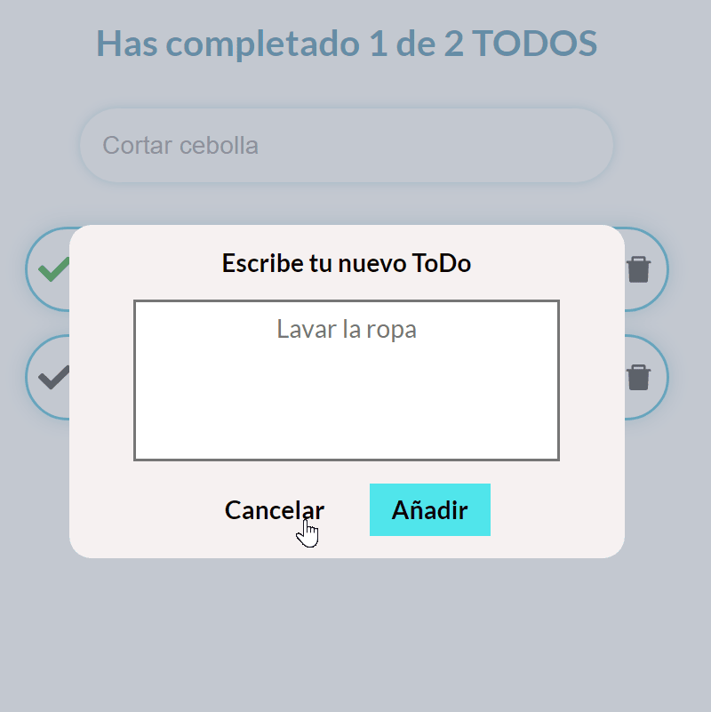
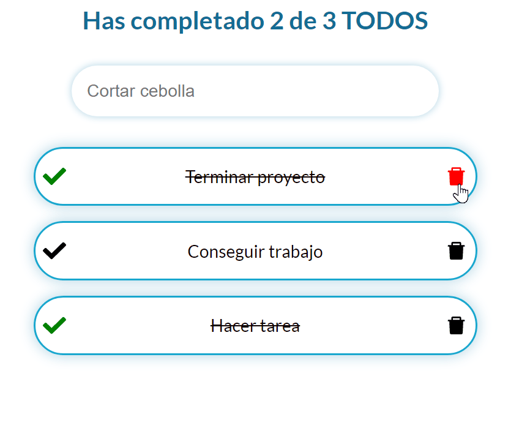

# ToDo List

## Descripcion
Este proyecto es un sitio web donde puedes hacer ToDo's, esta hecho con tecnologias como React y Sass, el sitio web tiene funcionalidades como crear ToDo's, poder marcar y desmarcar como realizadas las tareas, poder buscar ToDo's, mantenimiento de ToDo's aunque se cierre el sitio web.

Para el proyecto se utilizo React para la organizacion de componentes con uso de estados, useEffect, useContent, entre otras funcionalidades de la libreria y Sass para el facil y reusable estilado de componentes.

## Despliegue 
https://soyrandy708.github.io/ToDo-List/

    
     

